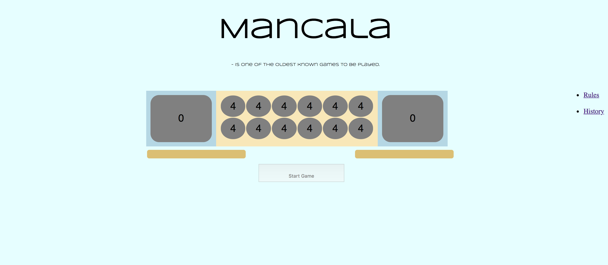

# Mancala
## Objective
To collect as many seeds in your Mancala as possible. 
The player with the most seeds in her/his Mancala at the end of the game wins. 
Player always moves around the board counter-clockwise, 
cells closest to you are yours &  Mancala/“bigCell” to your right belongs to you. 

## Technologies Used
* HTML
* CSS
* JavaScript

## Screenshot

## Next Steps
If the last gemstone is placed in an empty cup on the players own side, she/he may take all the gemstones from the opponents cup directly opposite of that cup. 

All the gemstones captured including the capturing stone are placed in the players own mancala.

Check it out
[Game - link](https://tiffeney.github.io/Mancala/)

